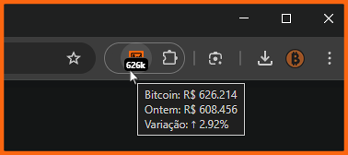
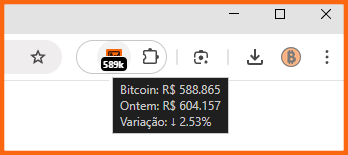

<p align="center">
  
</p>

# Bitcoin Price Ticker (BTC/BRL)

[](https://chrome.google.com/webstore/detail/acdibmngomngfmgjkghpebfndbhmeabb)
[](https://chrome.google.com/webstore/detail/acdibmngomngfmgjkghpebfndbhmeabb)
[](https://chrome.google.com/webstore/detail/acdibmngomngfmgjkghpebfndbhmeabb)
[](https://opensource.org/licenses/MIT)

A simple, lightweight, and reliable Chrome extension that displays the current price of Bitcoin (BTC) in Brazilian Real (BRL) directly on your browser's toolbar. Built for performance, privacy, and accuracy.

## Extension Preview

<p align="center">
  &nbsp;&nbsp;    
  
  &nbsp;&nbsp;
  
</p>


## Features

-   **Real-Time Price:** Get the BTC/BRL price updated every 60 seconds.
-   **Quick View Badge:** The extension icon shows a compact price (e.g., `588k`, `1.2m`).
-   **Smart Updates:** Update frequency is reduced when you're idle to save system resources and API calls.
-   **Detailed Tooltip:** Hover over the icon to see:
    -   The current price in BRL.
    -   The 24-hour opening price.
    -   The 24-hour price variation with visual indicators (e.g., `+2.52% ▲`).
-   **Reliable Data:** Uses the Binance API as the primary source and Bybit as an automatic fallback for maximum uptime.
-   **Quick Access to Trading:** Click the icon to open the BTC/BRL trading page on Binance.
-   **Lightweight & Private:** Minimal impact on browser performance. No data collection, no tracking.

## Installation

### From the Chrome Web Store (Recommended)

1.  Visit the BTC BRL Price Ticker page on the [Chrome Web Store](https://chrome.google.com/webstore/detail/acdibmngomngfmgjkghpebfndbhmeabb).
2.  Click "Add to Chrome".
3.  Pin the extension to your toolbar for easy access!

### From Source (for Development)

1.  **Clone the repository:**
    ```bash
    git clone https://github.com/ricardodelfino/btc-brl-price-ticker.git
    cd btc-brl-price-ticker
    ```
2.  **Install dependencies:**
    ```bash
    npm install
    ```
3.  **Build the extension:**
    ```bash
    npm run build
    ```
4.  **Load the extension in Chrome:**
    -   Open Chrome and navigate to `chrome://extensions`.
    -   Enable "Developer mode" in the top-right corner.
    -   Click "Load unpacked" and select the `dist` folder that was created by the build script.

## License

This project is licensed under the MIT License - see the `LICENSE` file for details.
